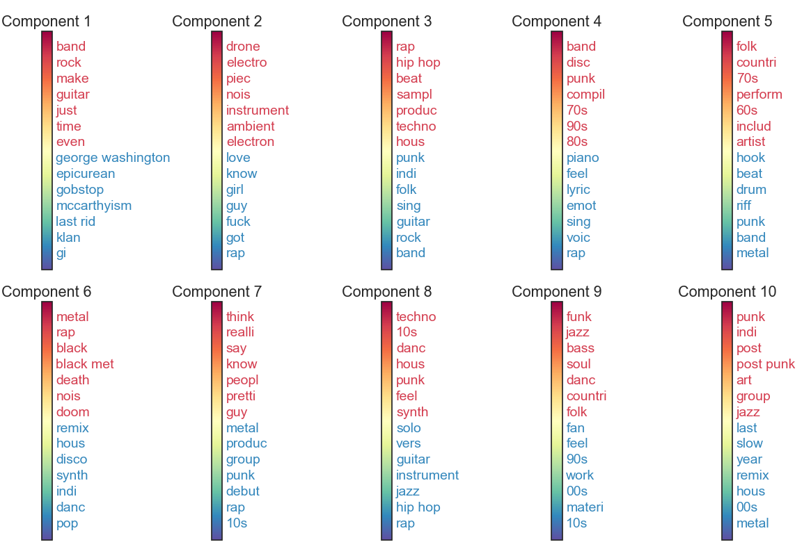

#### [AlbumPitch](http://www.albumpitch.com) is live now!

## Overview
This is a repository for the capstone project I did while attending Galvanize's Data Science Immersive class. In a nutshell, it is a music recommendation system that relies on text information gleaned from the web. It is a project that tries to capture all three phases of a typical data science product: data collection and storage, data analysis and modeling, and model deployment via a website. If you'd like to cut through the weeds, just visit [AlbumPitch](http://www.albumpitch.com) and start receiving recommendations! If you'd like to learn more about the process of how the project came to be, read on.

## Motivation
With the advent of online music streaming services like Spotify, Apple Music, Tidal, Pandora and others, we live in an age where it is incredibly easy to access any kind of music. As the average listener’s curiosity and desire for new music has increased, streaming platforms have adopted a combination of human curators and computer algorithms to help create personalized playlists that they believe the listener will enjoy. The vast majority of such playlists consist of individual songs from a mishmash of artists. However, it is in the album format that artists originally intended their music to be listened. Call me a traditionalist, but I am one of those people who prefers the full album experience. So what’s an album-phile like me to do? Well, this past decade has seen numerous dedicated music review sites come into existence. I figured that I could use the semantic content of these reviews to make album suggestions. For this project in particular, I decided to pair Pitchfork, one of the better known and more consistent music blogs, with Spotify, to create AlbumPitch, an album recommendation engine based solely on text information.

## Data collection and storage
#### Pitchfork site
As with any data science application, this project began with data collection. I scraped the entire Pitchfork site, which at the time had 17833 reviews spanning 9 genres. Some basic exploratory graphs summarizing the review meta-information are shown below.

**_Figure 1: Basic descriptive statistics of reviews scraped from Pitchfork._**

Genre distribution         |  # of reviews by reviewer | Review length distribution
:-------------------------:|:-------------------------:|:-------------------------:
 |  | 

If you'd like to obtain and play with this data yourself, simply run
```shell
python src/scrapers/pitchfork_scraper.py
```
to get the raw htmls, and then run
```shell
python src/parse_reviews.py pitchfork
```
to put the data in a nice, clean format. Note, you'll need MongoDB and pymongo installed on your local machine to store and process the data.

#### Spotify API
In order to run some validation tests, I used Spotify's audio features API call. This was a multistage process where I first tried to find the album id in the Spotify catalog corresponding to the Pitchfork album whose audio features I was interested in, then I would find all the track ids for that album, and finally I would retrieve the audio features for each and every track id. To get all this data, run
```
python src/spotify.py get_track_features
```
To do so, you'll need spotipy, a nice little python package to interact with the Spotify API.

Oftentimes, the call to Spotify to find an album id would result in multiple albums being returned. I needed to find the best correspondence between the Pitchfork album that seeded the query and one of the albums returned by Spotify, if any. To run this co-registration process, which relied on several carefully handcrafted heuristics that you might want to play around with, run
```
python src/spotify.py coregister_albums
```
I'm not guaranteeing that this matching process is perfect, as there will be some false positives and false negatives, but I would say it's within 1-3% of what's achievable. Also, Spotify's catalog, while immense, is far from complete with respect to albums that Pitchfork has reviewed.

#### PostgreSQL transfer
Ultimately, to put the Spotify and Pitchfork data into a more quickly manipulable format, a format that was also directly transferable to Heroku, I put all this data into a PostgreSQL database. To do likewise on your local machine, run
```
python mongo_to_sql.py
```
Note, you'll need a version of PostgreSQL installed on your local machine as well as the psycopg2 driver.

## Data analysis and modeling
#### Primary models
My two main tools for generating album recommendation from text data were Latent Semantic Analysis (LSA) and Latent Dirichlet Allocation (LDA), two algorithms famous for discovering hidden topics within a corpus of documents. I found from listening to A LOT of sample recommendations that in general LSA seemed to work better, so that's the method I stuck with. However, the bulk of my time to get either tool to work reasonably well was spent devising various regular expressions to capture some of the idiosyncrasies of music reviews, which, naturally, included a lot of references to artists, bands and albums, which are multi-token patterns that would get lost in the simplest of bag-of-words approach. The file `text_preprocess.py` contains most of the regular expressions. One of my other breakthroughs in LSA was using sublinear scaling on the TF term, which helped counteract the sometimes numerous mentions of one artist in a single review, and thus increased the relative importance of some of the more descriptive words.

#### Validation
As I mentioned, earballing the recommendations was the primary means by which I evaluated the models, but I did have a few heuristics I used to gauge how well LSA was doing. For one, I visualized A LOT (again) of the hidden dimensions that LSA would produce, seeing whether they were capturing words relevant to discriminating various genres of music (where relevant was based on my own personal experience reading music reviews). One such plot is shown below. As you can see, many of the terms do cluster along obvious genres such as rock, rap, electronic and acoustic (though it should be acknowledged that many terms are also less obviously related to music per se). Also note that I've applied the snowball stemmer to the words, which is why many of them have what appear to be missing suffixes.

**_Figure 2: Top 10 LSA components from a model with 200 dimensions._** 
*Each subplot shows a single hidden component discovered by LSA, with the 6 words having the heighest weight shown in red and the 6 words having the lowest weight shown in blue.*


We can go one step further and look at the clusters that k-means algorithm gives us when applied to data that has been transformed with LSA. Again, these seemed to make quite a bit of sense, reassuring me that the LSA approach in general was working.

**_Figure 3: 10 random clusters discovered by k-means algorithm (clustering was done in the LSA space)._** 
*Each subplot shows a single k-means cluster, with the 12 words having the heighest weight shown.*


However, some form of external validation would be better. For this, I turned to the audio features that I got from Spotify (via Echonest). As background, Spotify has quantified for a large collection of songs a number of subjective features, such as acousticness, danceability, energy, loudness and so on. I hypothesized that if my recommendations were making any sense, then the further down the recommendation list we go, the more dissimilar these albums should be to the album that initiated the query. Indeed, in the figure below, you can see that this monotonic increase in audio dissimilarity as a function of recommendation rank is present for all audio features examined, suggesting that the semantic content of music reviews has, to some degree, a relationship with audio features.

**_Figure 4: Audio feature differences between a seed album and a recommended album._** 
*Audio differences are plotted as a function of recommendation rank. All the y-axis labels should have the word "difference" added to them, but for clarity, those have been omitted.*


## Web app deployment
I deployed the final LSA-based recommendation system via a basic web app that you can explore [here](http://www.albumpitch.com). This app will produce, given either a seed album or a keyword search, a list of albums you might enjoy. A screenshot is provided below. It's not perfect by any means, as there are numerous improvements that could be made to the model, but in many instances it gives reasonable suggestions. Keep in mind, these recommendations are based solely on text information, so they're unlikely to be perfect. It really is a fun tool to play with! I've already found a few new albums through it that I like.


## Future directions
One of the most obvious next steps for this project would be to incorporate a Named Entity Recognition (NER) system that would allow for better identification of artist, band, album and song mentions within a piece of text. As I alluded to, I had to do quite a lot of regular expression magic to format the review data in such a way that its relevant features were consumable by the bag-of-words model, but this approach definitely fell short of what's achievable with a state-of-the-art NER. 

Another point of improvement for AlbumPitch would be better attribution of the various parts of the review to the relevant entity/concept. Oftentimes, a reviewer would compare the album that was the subject of the review to another album, and then spend a significant part of the review talking about how that other album was different, and of course that's all relevant information for making recommendations but also information that gets completely lost when we decompose the review into its constituent words. Along similar lines, it would be interesting to see whether dealing with sentences that contained words with strong sentiment association would provide more objective searches, independent of the reviewer's own bias. I guess this all depends on the intent of the application.

Last, I would love to do an experiment to see whether the semantic information I'm using to generate album suggestions could help improve recommendation systems that rely on a purely collaborative filtering approach.
